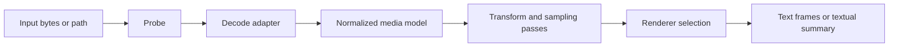

# atext Architecture

This document describes the intended implementation architecture for `atext`: the canonical pipeline, ownership boundaries, and extension seams that should remain stable as the project moves from bootstrap into a working renderer.

## Scope

This is the implementation contract for data flow and module ownership. Project principles live in [CONSTITUTION.md](CONSTITUTION.md). Contributor workflows live in [GUIDE.md](GUIDE.md).

## Architecture in One Sentence

`atext` should decode many media formats into a small set of normalized representations and render those representations into terminal-safe text based on detected terminal capabilities.

## Canonical Pipeline

The most important rule is the center of the pipeline:

- format-specific complexity belongs on the left
- renderer-specific complexity belongs on the right
- the normalized media model stays small and stable in the middle

## Current Bootstrap Layout

The repository is intentionally minimal today.

| Path | Responsibility |
| --- | --- |
| `src/lib.rs` | crate root and public re-exports |
| `src/media.rs` | media identity and probe-level metadata |
| `src/render.rs` | render intent and output-shape concepts |
| `src/terminal.rs` | terminal capability profile concepts |
| `README.md` and foundational docs | product and contributor contract |

These Rust modules are bootstrap scaffolding, not the final implementation split.

## Intended Stable Boundaries

As the implementation grows, the architecture should preserve these conceptual layers.

| Layer | Role |
| --- | --- |
| Probe | identify media type, dimensions, timing, and coarse metadata |
| Decode | turn format-specific bytes into shared visual/audio structures |
| Normalize | represent static frames, timed frame sequences, and audio summaries uniformly |
| Transform | resize, sample, crop, quantize, dither, or extract waveform/spectral views |
| Render | convert normalized data into text-safe terminal output |
| Runtime | detect terminal capabilities and stream output appropriately |

## Normalized Media Model

The normalized model should stay small. The current intended categories are:

| Category | Examples |
| --- | --- |
| Static visual frame | PNG, JPEG, single PDF page preview |
| Timed visual sequence | GIF, video, animated image sequence |
| Audio summary | waveform, envelope, spectrogram-oriented data |
| Metadata summary | fallback inspection for unsupported or partially supported assets |

This model is a design constraint. If a new format cannot fit into one of these categories, the first question should be whether the model needs a deliberate expansion, not whether the format should bypass it.

## Terminal Capability Model

Renderer selection should be driven by a shared terminal capability profile rather than scattered conditionals.

The capability model should account for:

- color support level
- Unicode reliability
- terminal dimensions
- whether output is interactive or log-oriented
- multiplexers such as `tmux`
- remote execution signals such as `ssh`
- whether animation is viable in the current session

## Renderer Families

The first renderer families should be explicit and few:

| Renderer family | Purpose |
| --- | --- |
| ASCII | lowest-common-denominator fallback |
| Block and Braille | higher-density static and animated visual rendering |
| Contact sheet | summarize timed sequences in a stable single frame |
| Waveform | quick inspection for audio amplitude and timing |
| Spectrogram | higher-information audio inspection when density allows |
| Metadata summary | truthful fallback when richer rendering is not possible |

## Auto-configuration Boundary

Auto-configuration belongs in two places:

1. Input probing
2. Terminal capability detection

It should not leak into every renderer as ad hoc local heuristics. Renderers should receive explicit plans derived from shared detection logic.

## Extension Seams

### Safe extensions

- add a new decoder backend behind the existing normalized model
- add a new transform pass that operates on normalized data
- add a new renderer family that consumes normalized data
- extend terminal capability detection in one shared place

### Coordinated changes

- expanding the normalized media categories
- adding a public API type at the crate root
- changing degradation rules
- changing the renderer selection policy

## Decision Rules

Use these rules when deciding where code belongs:

- If it identifies or describes the input asset, it belongs in probe or media modeling.
- If it depends on codec or container specifics, it belongs in decode.
- If it changes size, sampling, palette, or temporal density, it belongs in transform.
- If it maps normalized data to characters, ANSI colors, or terminal frame streams, it belongs in render.
- If it inspects `TERM`, `TMUX`, `COLORTERM`, window size, or remote execution context, it belongs in terminal capability logic.

## Performance Posture

Performance matters, but only in service of usable inspection:

1. Avoid unnecessary copies in the hot path.
2. Prefer reusable buffers for frame-oriented output.
3. Keep fallback renderers cheap and deterministic.
4. Preserve a path for stable CI-friendly output, not only interactive playback.

## Architectural Warning Signs

These usually indicate drift:

- a new input format requiring a new end-to-end pipeline
- renderer-specific terminal probing
- hidden quality changes based on environment details
- docs that still describe the previous boundary model
